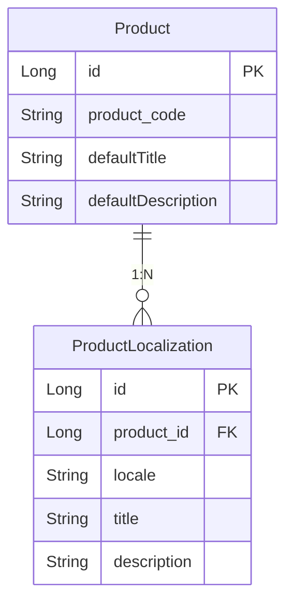

# spring-boot-locale-demo

Spring Boot를 이용한 다국어 서비스 구현 데모 프로젝트입니다.

## 📋 목차

- [프로젝트 개요](#프로젝트-개요)
- [다국어 처리 방식](#다국어-처리-방식)
- [방식별 비교](#방식별-비교)
- [DB 방식 구조](#db-방식-구조)
- [실행 방법](#실행-방법)
- [API 사용법](#api-사용법)

## 프로젝트 개요

이 프로젝트는 Spring Boot에서 다국어를 처리하는 두 가지 주요 방식을 비교하고 구현한 데모입니다.

1. **Properties 파일 방식** - Spring의 기본 MessageSource 활용
2. **데이터베이스 방식** - 동적 다국어 지원을 위한 DB 저장

## 다국어 처리 방식

### 1. Properties 파일 방식
- `messages_ko.properties`, `messages_en.properties` 등의 파일 사용
- Spring의 `MessageSource` 인터페이스 활용
- 애플리케이션 시작 시 메모리에 로드

### 2. 데이터베이스 방식
- 다국어 메시지를 DB 테이블에 저장
- 런타임에 동적으로 언어 추가/수정 가능
- 관리자 인터페이스를 통한 실시간 관리

## 방식별 비교

| 구분 | Properties 파일 | 데이터베이스 |
|------|----------------|--------------|
| **구현 복잡도** | 간단 (Spring 기본 기능) | 복잡 (테이블 설계, DAO/Service 구현 필요) |
| **성능** | 빠름 (메모리 로드) | 느림 (DB 조회 필요, 캐싱 권장) |
| **메시지 수정** | 파일 수정 후 재배포/리로드 | 실시간 수정 가능 |
| **관리 편의성** | 개발자만 수정 가능 | 관리자 화면으로 비개발자도 관리 |
| **확장성** | 메시지 수가 많으면 관리 어려움 | 대용량 데이터 처리 용이 |
| **동적 언어 추가** | 불가능 (파일 추가 후 배포 필요) | 가능 (런타임에 언어 추가) |
| **버전 관리** | 용이 (Git 등으로 관리) | 어려움 (DB 덤프 필요) |
| **장애 대응** | 파일 손상 시에만 영향 | DB 장애 시 다국어 서비스 중단 |
| **초기 설정** | MessageSource 설정만 | 테이블 생성, Entity/Repository 구현 |
| **캐싱** | 기본적으로 메모리 캐싱 | 별도 캐싱 구현 필요 |
| **다국어 파일 관리** | 언어별 파일 분리 관리 | DB 테이블로 통합 관리 |
| **배포 영향도** | 메시지 변경 시 배포 필요 | 배포 없이 메시지 변경 가능 |

## DB 방식 구조

데이터베이스 방식을 구현할 때 다음과 같은 엔티티 구조를 사용합니다.



### 테이블 설명
- **Product**: 상품의 기본 정보를 저장하는 메인 테이블
- **ProductLocalization**: 상품의 다국어 정보를 저장하는 테이블
- **관계**: 하나의 Product에 여러 개의 Localization이 있는 1:N 관계
- **제약조건**: `product_id`와 `locale`의 조합은 유니크 제약조건

## 실행 방법

### 환경 요구사항
- Java 17 이상
- Spring Boot 3.x

## API 사용법

### Properties 방식 예제
```kotlin
@RestController
class HelloController(
        private val messageSource: MessageSource
) {
    @GetMapping("/hello", produces = ["text/plain;charset=UTF-8"])
    fun hello(locale: Locale): String {
        val locale = LocaleContextHolder.getLocale()
        val text = messageSource.getMessage("hello", null, locale)
        return text
    }
}
```

### DB 방식 예제
```kotlin
@RestController
@RequestMapping("/api/products")
class ProductController(
    private val productReadService: ProductReadService,
) {

    @GetMapping("/{id}")
    fun getProduct(
        @PathVariable id: Long,
        locale: Locale,
    ): ResponseEntity<ProductDto> {

        val languageCode = locale.language.ifBlank { "en" }
        val dto = productReadService.get(productId = id, locale = languageCode)

        return ResponseEntity.ok()
            .header(HttpHeaders.CONTENT_LANGUAGE, languageCode)
            .body(dto)
    }
}
```
